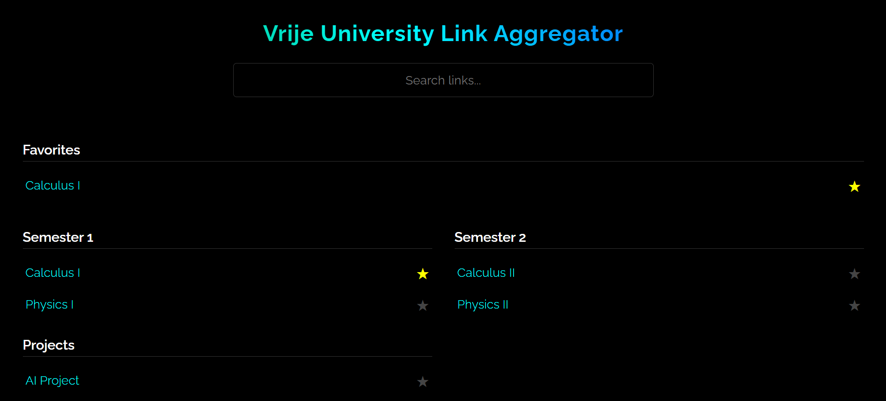

```md
# Vrije University Link Aggregator

A super simple, minimal, mobile-friendly link aggregator built with HTML, CSS, and JavaScript — perfect for organizing your course links, projects, or tools.

Inspired by [TUM.sexy](https://tum.sexy)

 

## 🚀 Features

- Dark futuristic theme with RGB-animated title
- Raleway font for clean minimalism
- Sections for Semester 1, 2, Projects, and more
- Favorites with localStorage (★ star)
- Search box for filtering
- Fully responsive, works on mobile
- GitHub-hostable (no frameworks needed)

## 📁 How to Use

1. Clone the repo or [download ZIP](https://github.com/VU-Devs/LA/archive/refs/heads/main.zip).
2. Open `index.html` in a browser.
3. Edit `script.js` to update or add new links (see [CONTRIBUTING.md](./CONTRIBUTING.md)).

## 🛠 Deploy to GitHub Pages

- Push the code to a repo
- Go to **Settings > Pages**
- Choose the `main` branch and `/root` as the source
- Your aggregator will be live at `https://your-username.github.io/repo-name/`

---

### 🙏 Contributing

See [CONTRIBUTING.md](./CONTRIBUTING.md). Thanks :3

---

Made By [Wayrion](https://github.com/Wayrion)
